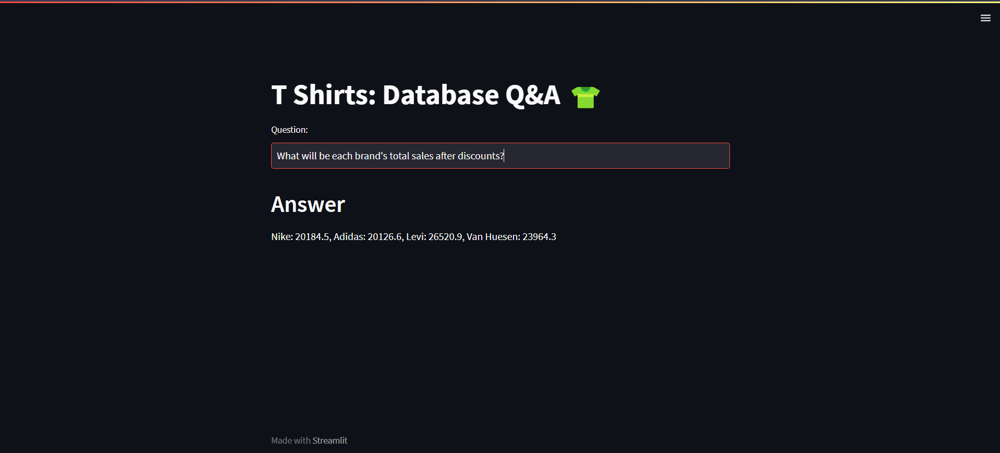

# Natural Language Processing with LLMs: Talking to a Database  

This project, based on Google Palm and Langchain, creates a system that can understand natural language questions from users and answer them by converting those questions to an SQL query and then executing that query on MySQL database.

- Users ask questions in plain English, like a store manager inquiring about inventory.
- The system translates these questions into Structured Query Language (SQL) commands.
- SQL queries interact with the MySQL database containing product information (inventory, sales, discounts).
- The system retrieves relevant data and presents the answer back to the user.

For instance, a manager might ask:
- "How many white Adidas t-shirts are left in stock?"
- "What additional sales could we generate by discounting all extra-small t-shirts?"

The system intelligently interprets these questions, formulates accurate SQL queries, and retrieves the answers from the database.

This allows users to access and analyze database information using natural language, making data exploration more intuitive.



## Project Highlights
 
- The inventory, sales and discounts data is stored in a MySQL database
- We will build an LLM based question and answer system that will use following,
  - Google Palm LLM
  - Hugging face embeddings
  - Streamlit for UI
  - Langchain framework
  - Chromadb as a vector store
  - Few shot learning
- In the UI, questions in a natural language will produce the answers in the form of MySQL query outputs.


## Installation

1.Clone this repository to your local machine using:

```bash
  git clone https://github.com/Sanket-Balani/nlp-llm-project.git
```
2. Install the required dependencies using pip:

```bash
  pip install -r requirements.txt
```
3.Acquire an api key through makersuite.google.com and put it in .env file

```bash
  GOOGLE_API_KEY="your_api_key_here"
```
4. For database setup, db_creation_t_shirts.sql in your MySQL workbench

## Usage

1. Run the Streamlit app by executing:
```bash
streamlit run main.py

```

2.The web app will open in your browser where you can ask questions.

## Sample Questions
  - How many t shirts are left in total in stock?
  - How many t-shirts do we have left for Nike in XS size and white color?
  - How much is the total price of the inventory for all L-size t-shirts?
  - How much sales amount will be generated if we sell all small size adidas shirts today after discounts?
  
## Project Structure

- main.py: The main Streamlit application script.
- langchain_helper.py: This has all the langchain code
- requirements.txt: A list of required Python packages for the project.
- few_shots.py: Contains few shot prompts
- .env: Configuration file for storing your Google API key.
